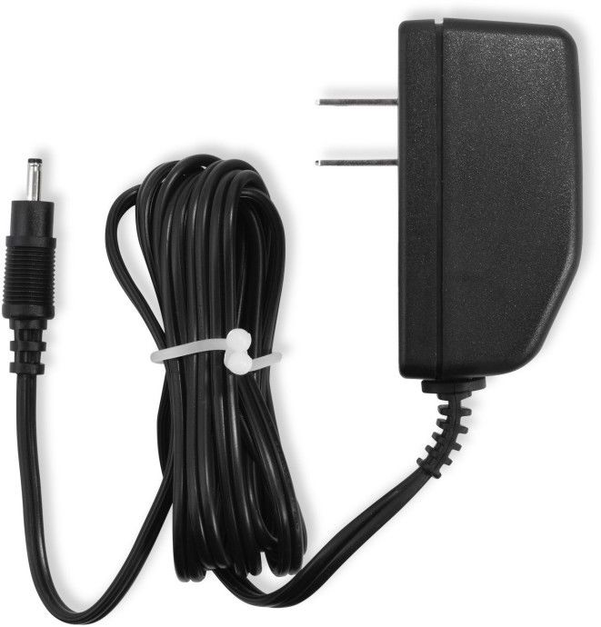

# Docking-station

## Vision

- Why do you `Turn off` the Mindstorms Brick?
- Why do you allow to `'live'` your Robot?

## Introduction

[Lego Mindstorms](https://www.lego.com/en-us/mindstorms/) is an educational line of products to learn Robotics.
In the Third generation of the product, exist a [Lego Mindstorms EV3 educational Set](https://education.lego.com/en-us/products/lego-mindstorms-education-ev3-core-set-/5003400)
which includes a Rechargeable battery and an electrical connector but the connector has been 
designed to be operated by humans.

> Why not help your robot to recharge itself?

## The solution

### 1. Custom connector

Lego Mindstorms has a [Battery Charger (45517)](https://shop.lego.com/en-US/Transformer-10V-DC-45517) 
which allows you to recharge the 45501 EV3 Rechargeable Battery.

Using some changes, it is possible to create a custom connector.

The connector include some magnets.

