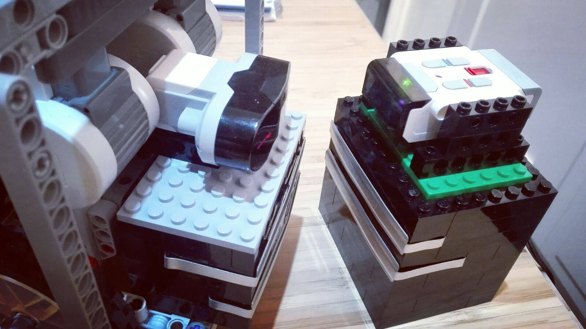

# Docking-station

## Vision

- Why do you `Turn off` the Mindstorms Brick?

## Introduction

[Lego Mindstorms](https://www.lego.com/en-us/mindstorms/) is an educational line of products to learn Robotics.
In the Third generation of the product, exist a [Lego Mindstorms EV3 educational Set](https://education.lego.com/en-us/products/lego-mindstorms-education-ev3-core-set-/5003400)
which includes a [Rechargeable battery (45501)](https://shop.lego.com/en-US/EV3-Rechargeable-DC-Battery-45501) and 
a [Battery Charger (45517)](https://shop.lego.com/en-US/Transformer-10V-DC-45517) but the charger, has been 
designed to be operated by humans.

> Why not help your robot to recharge itself?

## A solution

### 1. Custom connector

Lego Mindstorms has a [Battery Charger (45517)](https://shop.lego.com/en-US/Transformer-10V-DC-45517) 
which allows you to recharge the [Rechargeable battery (45501)](https://shop.lego.com/en-US/EV3-Rechargeable-DC-Battery-45501). 
If you do some changes in the cable of the charger, it is possible to create a custom connector like this one:



### 2. Is charging the Brick?

#### 2.1 Using an EV3 Light Sensor

The EV3 Rechargeable battery has 2 leds (green and red). 
Using lego Mindstorms has a [Light Sensor (45506)](https://shop.lego.com/en-US/EV3-Color-Sensor-45506) 
which it could be used to read the green led enabled which indicates that the battery is charging. 


**Limitations:** If you connect the sensor closed to the green led, you loose a Sensor Port.

#### 2.2 Using a HS110 Smart Plug 

In the market, exist Smart Plugs which are possible to operate using a REST API.
One product used in this project is [TP HS 110](http://www.tp-link.com/us/products/details/cat-5516_HS110.html):


Using this kind of devices, is possible to know if the EV3 Brick are charging or not:

**Output when an EV3 Brick is not connected:**

```
Parsing: {"emeter":{"get_realtime":{"current":0.012227,"voltage":242.435362,"power":0,"total":0.006000,"err_code":0}}}
Power: 0.0W, Total Consumption: 0.006kWh Current: 0.012227A Voltage: 242.435362
```

**Output when an EV3 Brick is connected:**

```
Parsing: {"emeter":{"get_realtime":{"current":0.038435,"voltage":242.617563,"power":4.639256,"total":0.006000,"err_code":0}}}
Power: 4.639256W, Total Consumption: 0.006kWh Current: 0.038435A Voltage: 242.617563
```

### 3. Where is the Docking Station?

Once, the robot has a connector to use in an autonomous way, 
it is necessary to help the robot to locate the docking station. 
This kind of problem could be sorted in the **Local Navigation** category.

> **Local navigation:** The ability to determine one's position relative to objects (stationary or moving) in the environment, and not collide with them as one moves.

### 3.1 Using a custom Arduino IR Beacon

Lego Mindstorms EV3 has a [IR Sensor (45509)](https://shop.lego.com/en-US/EV3-Infrared-Sensor-45509) 
which is able to process signals from a [IR Beacon (45508)](https://shop.lego.com/en-US/EV3-Infrared-Beacon-45508):


The LEGO IR Beacon is nice but after a period of time, the Beacon shutdown so,
it is necessary to find custom solution which never turn off.

**Note:** `Shane Gingell` from `Out of the BOTS` are working in an Arduino solution.

### 3.2 Add a SLAM Solution

Using a SLAM Solution, it could be possible to know where is the robot with accuracy.

#### ROS Cartographer SLAM


#### LeJOS SLAM System


## Development

### Example:

``` java
package examples;

import com.intrbiz.iot.hs110.HS110Client;
import com.intrbiz.iot.hs110.model.GetRealtime;
import ev3dev.actuators.lego.motors.Motor;
import ev3dev.sensors.Battery;
import ev3dev.sensors.ev3.EV3IRSensor;
import lejos.hardware.port.SensorPort;
import lejos.robotics.RegulatedMotor;
import lejos.robotics.navigation.DifferentialPilot;
import lejos.utility.Delay;
import lombok.extern.slf4j.Slf4j;

import java.io.IOException;
import java.io.InputStream;
import java.util.Properties;

/**
 * Created by jabrena on 9/9/17.
 */
public @Slf4j class Demo1 {

    private static final int MAX_ITERATIONS = 20;

    //Robot Configuration
    private static final PilotConfig pilotConf = new PilotConfig();
    private static final DifferentialPilot pilot = pilotConf.getPilot();

    //EV3 Battery threshold
    //private static float EV3BATTERY_WARN_LEVEL = 7.60f;
    private static float EV3BATTERY_WARN_LEVEL = 8.00f;
    private static float EV3BATTERY_OK_LEVEL = 8.15f;
    private static float EV3BATTERY_UNDOCK_LEVEL = 8.25f;
    private static float EV3BATTERY_MAX_LEVEL = 8.50f;

    //HS110
    private static final String HS110_CONFIG_FILE = "HS110.properties";
    private static final String HS110_CONFIG_IP_FIELD = "ip";
    private static HS110Client hs110;

    //MOTORS Used to Uncharge quickly (simulation real activity)
    private static RegulatedMotor extraMotor1 = Motor.B;
    private static RegulatedMotor extraMotor2 = Motor.C;

    public static void main(String[] args) throws Exception {

        LOGGER.info("Running a simple FMS to Recharge an EV3 battery");

        //To Stop the motor (Example: in case of pkill java for example)
        Runtime.getRuntime().addShutdownHook(new Thread(new Runnable() {
            public void run() {
                pilot.stop();
                LOGGER.info("{}", Battery.getInstance().getVoltage());
                LOGGER.info("Catakroker!!!");

                extraMotor1.stop();
                extraMotor2.stop();
            }
        }));

        extraMotor1 = Motor.B;
        extraMotor2 = Motor.C;

        final Battery EV3Battery = Battery.getInstance();

        final String hs110Location = getHS110Location();
        hs110 = new HS110Client(hs110Location);

        enableLed(0);

        float ev3Voltage = 0.0f;
        boolean charging = false;
        int iteration = 0;

        while(true) {

            iteration++;
            extraMotor1.stop();
            extraMotor2.stop();

            ev3Voltage = EV3Battery.getVoltage();
            charging = updateCharging();
            LOGGER.info("Iteration: {}, EV3 Battery: {}, Charging: {}", iteration, ev3Voltage, charging);

            if (ev3Voltage <= EV3BATTERY_WARN_LEVEL) {
                LOGGER.info("STATE: Go to Docking Station");

                pilot.forward();
                if (charging) {
                    pilot.stop();
                }
            } else if(
                    (ev3Voltage > EV3BATTERY_WARN_LEVEL) &&
                    (ev3Voltage <= EV3BATTERY_OK_LEVEL)) {
                LOGGER.info("STATE: Charging process");

                if(charging) {
                    pilot.stop();
                    Delay.msDelay(10000);
                }else {
                    pilot.forward();
                }

            } else if (
                    (ev3Voltage > EV3BATTERY_OK_LEVEL) &&
                    (ev3Voltage <= EV3BATTERY_UNDOCK_LEVEL)) {

                LOGGER.info("STATE: Charging Good Level");

                if (charging) {
                    pilot.stop();
                    Delay.msDelay(10000);
                } else {
                    pilot.forward();
                }

            } else if (
                    (ev3Voltage > EV3BATTERY_UNDOCK_LEVEL) &&
                    (ev3Voltage <= EV3BATTERY_MAX_LEVEL)) {

                Delay.msDelay(30000);

                if(charging){
                    LOGGER.info("STATE: Undocking process");

                    pilot.travel(-20);
                    pilot.stop();
                }

                charging = updateCharging();
                if(!charging){
                    LOGGER.info("STATE: Uncharging process");
                    //extraMotor1.forward();
                    extraMotor2.forward();
                }

                Delay.msDelay(5000);

            }

        }

    }

    private static boolean updateCharging() throws Exception {
        GetRealtime response = hs110.consumption();
        return (response.getPower() == 0.0d) ? false : true;
    }

    private static String getHS110Location() throws IOException {
        final InputStream in = ClassLoader.getSystemResourceAsStream(HS110_CONFIG_FILE);
        final Properties prop = new Properties();
        prop.load(in);
        in.close();

        return prop.getProperty(HS110_CONFIG_IP_FIELD);
    }

    private static void enableLed(final int i) throws Exception {
        if (i % 2 == 0) {
            hs110.ledOn();
        } else {
            hs110.ledOff();
        }
    }

}
```

**Traces:**

```
java -server -jar /home/robot/docking-station-0.1.0-SNAPSHOT-all.jar 
ev3dev#33|2017-09-09 17:42:32 [main] INFO  examples.Demo1 - Running a simple FMS to Recharge an EV3 battery
ev3dev#33|2017-09-09 17:43:04 [main] INFO  examples.Demo1 - Iteration: 1, EV3 Battery: 8.142733, Charging: false
ev3dev#33|2017-09-09 17:43:04 [main] INFO  examples.Demo1 - STATE: Charging process
ev3dev#33|2017-09-09 17:43:05 [main] INFO  examples.Demo1 - Iteration: 2, EV3 Battery: 8.111266, Charging: false
ev3dev#33|2017-09-09 17:43:05 [main] INFO  examples.Demo1 - STATE: Charging process
ev3dev#33|2017-09-09 17:43:06 [main] INFO  examples.Demo1 - Iteration: 3, EV3 Battery: 8.111266, Charging: false
ev3dev#33|2017-09-09 17:43:06 [main] INFO  examples.Demo1 - STATE: Charging process
ev3dev#33|2017-09-09 17:43:07 [main] INFO  examples.Demo1 - Iteration: 4, EV3 Battery: 8.111866, Charging: false
ev3dev#33|2017-09-09 17:43:07 [main] INFO  examples.Demo1 - STATE: Charging process
ev3dev#33|2017-09-09 17:43:08 [main] INFO  examples.Demo1 - Iteration: 5, EV3 Battery: 8.096466, Charging: false
ev3dev#33|2017-09-09 17:43:08 [main] INFO  examples.Demo1 - STATE: Charging process
ev3dev#33|2017-09-09 17:43:08 [main] INFO  examples.Demo1 - Iteration: 6, EV3 Battery: 8.1122, Charging: false
ev3dev#33|2017-09-09 17:43:08 [main] INFO  examples.Demo1 - STATE: Charging process
ev3dev#33|2017-09-09 17:43:09 [main] INFO  examples.Demo1 - Iteration: 7, EV3 Battery: 8.149333, Charging: false
ev3dev#33|2017-09-09 17:43:09 [main] INFO  examples.Demo1 - STATE: Charging process
ev3dev#33|2017-09-09 17:43:10 [main] INFO  examples.Demo1 - Iteration: 8, EV3 Battery: 8.150333, Charging: true
ev3dev#33|2017-09-09 17:43:10 [main] INFO  examples.Demo1 - STATE: Charging Good Level
ev3dev#33|2017-09-09 17:43:20 [main] INFO  examples.Demo1 - Iteration: 9, EV3 Battery: 8.223, Charging: true
ev3dev#33|2017-09-09 17:43:20 [main] INFO  examples.Demo1 - STATE: Charging Good Level
ev3dev#33|2017-09-09 17:43:30 [main] INFO  examples.Demo1 - Iteration: 10, EV3 Battery: 8.233, Charging: true
ev3dev#33|2017-09-09 17:43:30 [main] INFO  examples.Demo1 - STATE: Charging Good Level
ev3dev#33|2017-09-09 17:43:41 [main] INFO  examples.Demo1 - Iteration: 11, EV3 Battery: 8.233, Charging: true
ev3dev#33|2017-09-09 17:43:41 [main] INFO  examples.Demo1 - STATE: Charging Good Level
ev3dev#33|2017-09-09 17:43:51 [main] INFO  examples.Demo1 - Iteration: 12, EV3 Battery: 8.243, Charging: true
ev3dev#33|2017-09-09 17:43:51 [main] INFO  examples.Demo1 - STATE: Charging Good Level
ev3dev#33|2017-09-09 17:44:01 [main] INFO  examples.Demo1 - Iteration: 13, EV3 Battery: 8.243, Charging: true
ev3dev#33|2017-09-09 17:44:01 [main] INFO  examples.Demo1 - STATE: Charging Good Level
ev3dev#33|2017-09-09 17:44:11 [main] INFO  examples.Demo1 - Iteration: 14, EV3 Battery: 8.243, Charging: true
ev3dev#33|2017-09-09 17:44:11 [main] INFO  examples.Demo1 - STATE: Charging Good Level
ev3dev#33|2017-09-09 17:44:22 [main] INFO  examples.Demo1 - Iteration: 15, EV3 Battery: 8.253, Charging: true
ev3dev#33|2017-09-09 17:44:22 [main] INFO  examples.Demo1 - STATE: Undocking process
ev3dev#33|2017-09-09 17:44:24 [main] INFO  examples.Demo1 - STATE: Uncharging process
ev3dev#33|2017-09-09 17:44:29 [main] INFO  examples.Demo1 - Iteration: 16, EV3 Battery: 8.1466, Charging: false
ev3dev#33|2017-09-09 17:44:29 [main] INFO  examples.Demo1 - STATE: Charging process
ev3dev#33|2017-09-09 17:44:30 [main] INFO  examples.Demo1 - Iteration: 17, EV3 Battery: 8.131866, Charging: false
ev3dev#33|2017-09-09 17:44:30 [main] INFO  examples.Demo1 - STATE: Charging process
ev3dev#33|2017-09-09 17:44:31 [main] INFO  examples.Demo1 - Iteration: 18, EV3 Battery: 8.138933, Charging: false
ev3dev#33|2017-09-09 17:44:31 [main] INFO  examples.Demo1 - STATE: Charging process
ev3dev#33|2017-09-09 17:44:31 [main] INFO  examples.Demo1 - Iteration: 19, EV3 Battery: 8.1312, Charging: false
ev3dev#33|2017-09-09 17:44:31 [main] INFO  examples.Demo1 - STATE: Charging process
ev3dev#33|2017-09-09 17:44:32 [main] INFO  examples.Demo1 - Iteration: 20, EV3 Battery: 8.121866, Charging: false
ev3dev#33|2017-09-09 17:44:32 [main] INFO  examples.Demo1 - STATE: Charging process
ev3dev#33|2017-09-09 17:44:33 [main] INFO  examples.Demo1 - Iteration: 21, EV3 Battery: 8.115133, Charging: false
ev3dev#33|2017-09-09 17:44:34 [main] INFO  examples.Demo1 - STATE: Charging process
ev3dev#33|2017-09-09 17:44:34 [main] INFO  examples.Demo1 - Iteration: 22, EV3 Battery: 8.179333, Charging: true
ev3dev#33|2017-09-09 17:44:34 [main] INFO  examples.Demo1 - STATE: Charging Good Level
ev3dev#33|2017-09-09 17:44:45 [main] INFO  examples.Demo1 - Iteration: 23, EV3 Battery: 8.242666, Charging: true
ev3dev#33|2017-09-09 17:44:45 [main] INFO  examples.Demo1 - STATE: Charging Good Level
ev3dev#33|2017-09-09 17:44:55 [main] INFO  examples.Demo1 - Iteration: 24, EV3 Battery: 8.252666, Charging: true
ev3dev#33|2017-09-09 17:44:55 [main] INFO  examples.Demo1 - STATE: Undocking process
ev3dev#33|2017-09-09 17:44:57 [main] INFO  examples.Demo1 - STATE: Uncharging process
ev3dev#33|2017-09-09 17:45:02 [main] INFO  examples.Demo1 - Iteration: 25, EV3 Battery: 8.155, Charging: false
ev3dev#33|2017-09-09 17:45:02 [main] INFO  examples.Demo1 - STATE: Charging Good Level
ev3dev#33|2017-09-09 17:45:03 [main] INFO  examples.Demo1 - Iteration: 26, EV3 Battery: 8.130866, Charging: false
ev3dev#33|2017-09-09 17:45:03 [main] INFO  examples.Demo1 - STATE: Charging process
ev3dev#33|2017-09-09 17:45:03 [main] INFO  examples.Demo1 - Iteration: 27, EV3 Battery: 8.130866, Charging: false
ev3dev#33|2017-09-09 17:45:03 [main] INFO  examples.Demo1 - STATE: Charging process
ev3dev#33|2017-09-09 17:45:04 [main] INFO  examples.Demo1 - Iteration: 28, EV3 Battery: 8.131533, Charging: false
ev3dev#33|2017-09-09 17:45:04 [main] INFO  examples.Demo1 - STATE: Charging process
ev3dev#33|2017-09-09 17:45:05 [main] INFO  examples.Demo1 - Iteration: 29, EV3 Battery: 8.130866, Charging: false
ev3dev#33|2017-09-09 17:45:05 [main] INFO  examples.Demo1 - STATE: Charging process
ev3dev#33|2017-09-09 17:45:05 [main] INFO  examples.Demo1 - Iteration: 30, EV3 Battery: 8.130533, Charging: false
ev3dev#33|2017-09-09 17:45:05 [main] INFO  examples.Demo1 - STATE: Charging process
ev3dev#33|2017-09-09 17:45:06 [main] INFO  examples.Demo1 - Iteration: 31, EV3 Battery: 8.1168, Charging: false
ev3dev#33|2017-09-09 17:45:06 [main] INFO  examples.Demo1 - STATE: Charging process
ev3dev#33|2017-09-09 17:45:06 [main] INFO  examples.Demo1 - Iteration: 32, EV3 Battery: 8.129866, Charging: false
ev3dev#33|2017-09-09 17:45:07 [main] INFO  examples.Demo1 - STATE: Charging process
ev3dev#33|2017-09-09 17:45:07 [main] INFO  examples.Demo1 - Iteration: 33, EV3 Battery: 8.067533, Charging: false
ev3dev#33|2017-09-09 17:45:07 [main] INFO  examples.Demo1 - STATE: Charging process
ev3dev#33|2017-09-09 17:45:08 [main] INFO  examples.Demo1 - Iteration: 34, EV3 Battery: 8.178333, Charging: false
ev3dev#33|2017-09-09 17:45:08 [main] INFO  examples.Demo1 - STATE: Charging Good Level
ev3dev#33|2017-09-09 17:45:08 [main] INFO  examples.Demo1 - Iteration: 35, EV3 Battery: 8.179, Charging: true
ev3dev#33|2017-09-09 17:45:08 [main] INFO  examples.Demo1 - STATE: Charging Good Level
ev3dev#33|2017-09-09 17:45:19 [main] INFO  examples.Demo1 - Iteration: 36, EV3 Battery: 8.243, Charging: true
ev3dev#33|2017-09-09 17:45:19 [main] INFO  examples.Demo1 - STATE: Charging Good Level
ev3dev#33|2017-09-09 17:45:29 [main] INFO  examples.Demo1 - Iteration: 37, EV3 Battery: 8.243, Charging: true
ev3dev#33|2017-09-09 17:45:29 [main] INFO  examples.Demo1 - STATE: Charging Good Level
ev3dev#33|2017-09-09 17:45:39 [main] INFO  examples.Demo1 - Iteration: 38, EV3 Battery: 8.253, Charging: true
ev3dev#33|2017-09-09 17:45:39 [main] INFO  examples.Demo1 - STATE: Undocking process
ev3dev#33|2017-09-09 17:45:41 [main] INFO  examples.Demo1 - STATE: Uncharging process
ev3dev#33|2017-09-09 17:45:46 [main] INFO  examples.Demo1 - Iteration: 39, EV3 Battery: 8.154666, Charging: false
ev3dev#33|2017-09-09 17:45:46 [main] INFO  examples.Demo1 - STATE: Charging Good Level
ev3dev#33|2017-09-09 17:45:47 [main] INFO  examples.Demo1 - Iteration: 40, EV3 Battery: 8.1312, Charging: false
ev3dev#33|2017-09-09 17:45:47 [main] INFO  examples.Demo1 - STATE: Charging process
ev3dev#33|2017-09-09 17:45:47 [main] INFO  examples.Demo1 - Iteration: 41, EV3 Battery: 8.139533, Charging: false
ev3dev#33|2017-09-09 17:45:47 [main] INFO  examples.Demo1 - STATE: Charging process
ev3dev#33|2017-09-09 17:45:48 [main] INFO  examples.Demo1 - Iteration: 42, EV3 Battery: 8.139866, Charging: false
ev3dev#33|2017-09-09 17:45:48 [main] INFO  examples.Demo1 - STATE: Charging process
ev3dev#33|2017-09-09 17:45:48 [main] INFO  examples.Demo1 - Iteration: 43, EV3 Battery: 8.130866, Charging: false
ev3dev#33|2017-09-09 17:45:48 [main] INFO  examples.Demo1 - STATE: Charging process
ev3dev#33|2017-09-09 17:45:49 [main] INFO  examples.Demo1 - Iteration: 44, EV3 Battery: 8.131533, Charging: false
ev3dev#33|2017-09-09 17:45:49 [main] INFO  examples.Demo1 - STATE: Charging process
ev3dev#33|2017-09-09 17:45:50 [main] INFO  examples.Demo1 - Iteration: 45, EV3 Battery: 8.121866, Charging: false
ev3dev#33|2017-09-09 17:45:50 [main] INFO  examples.Demo1 - STATE: Charging process
ev3dev#33|2017-09-09 17:45:50 [main] INFO  examples.Demo1 - Iteration: 46, EV3 Battery: 8.122466, Charging: false
ev3dev#33|2017-09-09 17:45:50 [main] INFO  examples.Demo1 - STATE: Charging process
ev3dev#33|2017-09-09 17:45:51 [main] INFO  examples.Demo1 - Iteration: 47, EV3 Battery: 8.1478, Charging: false
ev3dev#33|2017-09-09 17:45:51 [main] INFO  examples.Demo1 - STATE: Charging process
ev3dev#33|2017-09-09 17:45:52 [main] INFO  examples.Demo1 - Iteration: 48, EV3 Battery: 8.062733, Charging: true
ev3dev#33|2017-09-09 17:45:52 [main] INFO  examples.Demo1 - STATE: Charging process
ev3dev#33|2017-09-09 17:46:02 [main] INFO  examples.Demo1 - Iteration: 49, EV3 Battery: 8.243, Charging: true
ev3dev#33|2017-09-09 17:46:03 [main] INFO  examples.Demo1 - STATE: Charging Good Level
ev3dev#33|2017-09-09 17:46:13 [main] INFO  examples.Demo1 - Iteration: 50, EV3 Battery: 8.253, Charging: true
ev3dev#33|2017-09-09 17:46:13 [main] INFO  examples.Demo1 - STATE: Undocking process
ev3dev#33|2017-09-09 17:46:20 [main] INFO  examples.Demo1 - Iteration: 51, EV3 Battery: 8.155, Charging: false
ev3dev#33|2017-09-09 17:46:20 [main] INFO  examples.Demo1 - STATE: Charging Good Level
ev3dev#33|2017-09-09 17:46:20 [main] INFO  examples.Demo1 - Iteration: 52, EV3 Battery: 8.1238, Charging: false
ev3dev#33|2017-09-09 17:46:20 [main] INFO  examples.Demo1 - STATE: Charging process
ev3dev#33|2017-09-09 17:46:21 [main] INFO  examples.Demo1 - Iteration: 53, EV3 Battery: 8.130533, Charging: false
ev3dev#33|2017-09-09 17:46:21 [main] INFO  examples.Demo1 - STATE: Charging process
ev3dev#33|2017-09-09 17:46:21 [main] INFO  examples.Demo1 - Iteration: 54, EV3 Battery: 8.122466, Charging: false
ev3dev#33|2017-09-09 17:46:21 [main] INFO  examples.Demo1 - STATE: Charging process
ev3dev#33|2017-09-09 17:46:22 [main] INFO  examples.Demo1 - Iteration: 55, EV3 Battery: 8.132133, Charging: false
ev3dev#33|2017-09-09 17:46:22 [main] INFO  examples.Demo1 - STATE: Charging process
ev3dev#33|2017-09-09 17:46:22 [main] INFO  examples.Demo1 - Iteration: 56, EV3 Battery: 8.1312, Charging: false
ev3dev#33|2017-09-09 17:46:22 [main] INFO  examples.Demo1 - STATE: Charging process
ev3dev#33|2017-09-09 17:46:23 [main] INFO  examples.Demo1 - Iteration: 57, EV3 Battery: 8.1312, Charging: false
ev3dev#33|2017-09-09 17:46:23 [main] INFO  examples.Demo1 - STATE: Charging process
ev3dev#33|2017-09-09 17:46:23 [main] INFO  examples.Demo1 - Iteration: 58, EV3 Battery: 8.139866, Charging: false
ev3dev#33|2017-09-09 17:46:23 [main] INFO  examples.Demo1 - STATE: Charging process
ev3dev#33|2017-09-09 17:46:24 [main] INFO  examples.Demo1 - Iteration: 59, EV3 Battery: 8.1168, Charging: false
ev3dev#33|2017-09-09 17:46:24 [main] INFO  examples.Demo1 - STATE: Charging process
ev3dev#33|2017-09-09 17:46:24 [main] INFO  examples.Demo1 - Iteration: 60, EV3 Battery: 8.101, Charging: true
ev3dev#33|2017-09-09 17:46:24 [main] INFO  examples.Demo1 - STATE: Charging process
ev3dev#33|2017-09-09 17:46:34 [main] INFO  examples.Demo1 - Iteration: 61, EV3 Battery: 8.242666, Charging: true
ev3dev#33|2017-09-09 17:46:34 [main] INFO  examples.Demo1 - STATE: Charging Good Level
ev3dev#33|2017-09-09 17:46:44 [main] INFO  examples.Demo1 - Iteration: 62, EV3 Battery: 8.252666, Charging: true
ev3dev#33|2017-09-09 17:46:44 [main] INFO  examples.Demo1 - STATE: Undocking process
ev3dev#33|2017-09-09 17:46:51 [main] INFO  examples.Demo1 - Iteration: 63, EV3 Battery: 8.165, Charging: false
ev3dev#33|2017-09-09 17:46:51 [main] INFO  examples.Demo1 - STATE: Charging Good Level
ev3dev#33|2017-09-09 17:46:52 [main] INFO  examples.Demo1 - Iteration: 64, EV3 Battery: 8.132133, Charging: false
ev3dev#33|2017-09-09 17:46:52 [main] INFO  examples.Demo1 - STATE: Charging process
ev3dev#33|2017-09-09 17:46:52 [main] INFO  examples.Demo1 - Iteration: 65, EV3 Battery: 8.123466, Charging: false
ev3dev#33|2017-09-09 17:46:52 [main] INFO  examples.Demo1 - STATE: Charging process
ev3dev#33|2017-09-09 17:46:53 [main] INFO  examples.Demo1 - Iteration: 66, EV3 Battery: 8.1312, Charging: false
ev3dev#33|2017-09-09 17:46:53 [main] INFO  examples.Demo1 - STATE: Charging process
ev3dev#33|2017-09-09 17:46:53 [main] INFO  examples.Demo1 - Iteration: 67, EV3 Battery: 8.131533, Charging: false
ev3dev#33|2017-09-09 17:46:53 [main] INFO  examples.Demo1 - STATE: Charging process
ev3dev#33|2017-09-09 17:46:54 [main] INFO  examples.Demo1 - Iteration: 68, EV3 Battery: 8.130866, Charging: false
ev3dev#33|2017-09-09 17:46:54 [main] INFO  examples.Demo1 - STATE: Charging process
ev3dev#33|2017-09-09 17:46:54 [main] INFO  examples.Demo1 - Iteration: 69, EV3 Battery: 8.1312, Charging: false
ev3dev#33|2017-09-09 17:46:54 [main] INFO  examples.Demo1 - STATE: Charging process
ev3dev#33|2017-09-09 17:46:55 [main] INFO  examples.Demo1 - Iteration: 70, EV3 Battery: 8.139866, Charging: false
ev3dev#33|2017-09-09 17:46:55 [main] INFO  examples.Demo1 - STATE: Charging process
ev3dev#33|2017-09-09 17:46:55 [main] INFO  examples.Demo1 - Iteration: 71, EV3 Battery: 8.139866, Charging: false
ev3dev#33|2017-09-09 17:46:55 [main] INFO  examples.Demo1 - STATE: Charging process
ev3dev#33|2017-09-09 17:46:55 [main] INFO  examples.Demo1 - Iteration: 72, EV3 Battery: 8.130866, Charging: false
ev3dev#33|2017-09-09 17:46:55 [main] INFO  examples.Demo1 - STATE: Charging process
ev3dev#33|2017-09-09 17:46:56 [main] INFO  examples.Demo1 - Iteration: 73, EV3 Battery: 8.139266, Charging: false
ev3dev#33|2017-09-09 17:46:56 [main] INFO  examples.Demo1 - STATE: Charging process
ev3dev#33|2017-09-09 17:46:56 [main] INFO  examples.Demo1 - Iteration: 74, EV3 Battery: 8.122133, Charging: false
ev3dev#33|2017-09-09 17:46:56 [main] INFO  examples.Demo1 - STATE: Charging process
ev3dev#33|2017-09-09 17:46:57 [main] INFO  examples.Demo1 - Iteration: 75, EV3 Battery: 8.188333, Charging: false
ev3dev#33|2017-09-09 17:46:57 [main] INFO  examples.Demo1 - STATE: Charging Good Level
ev3dev#33|2017-09-09 17:46:58 [main] INFO  examples.Demo1 - Iteration: 76, EV3 Battery: 8.1388, Charging: true
ev3dev#33|2017-09-09 17:46:58 [main] INFO  examples.Demo1 - STATE: Charging process
ev3dev#33|2017-09-09 17:47:08 [main] INFO  examples.Demo1 - Iteration: 77, EV3 Battery: 8.253, Charging: true
ev3dev#33|2017-09-09 17:47:08 [main] INFO  examples.Demo1 - STATE: Undocking process
ev3dev#33|2017-09-09 17:47:10 [main] INFO  examples.Demo1 - STATE: Uncharging process
ev3dev#33|2017-09-09 17:47:16 [main] INFO  examples.Demo1 - Iteration: 78, EV3 Battery: 8.1566, Charging: false
ev3dev#33|2017-09-09 17:47:16 [main] INFO  examples.Demo1 - STATE: Charging Good Level
ev3dev#33|2017-09-09 17:47:16 [main] INFO  examples.Demo1 - Iteration: 79, EV3 Battery: 8.123466, Charging: false
ev3dev#33|2017-09-09 17:47:16 [main] INFO  examples.Demo1 - STATE: Charging process
ev3dev#33|2017-09-09 17:47:16 [main] INFO  examples.Demo1 - Iteration: 80, EV3 Battery: 8.1312, Charging: false
ev3dev#33|2017-09-09 17:47:16 [main] INFO  examples.Demo1 - STATE: Charging process
ev3dev#33|2017-09-09 17:47:17 [main] INFO  examples.Demo1 - Iteration: 81, EV3 Battery: 8.130866, Charging: false
ev3dev#33|2017-09-09 17:47:17 [main] INFO  examples.Demo1 - STATE: Charging process
ev3dev#33|2017-09-09 17:47:17 [main] INFO  examples.Demo1 - Iteration: 82, EV3 Battery: 8.131533, Charging: false
ev3dev#33|2017-09-09 17:47:17 [main] INFO  examples.Demo1 - STATE: Charging process
ev3dev#33|2017-09-09 17:47:18 [main] INFO  examples.Demo1 - Iteration: 83, EV3 Battery: 8.130866, Charging: false
ev3dev#33|2017-09-09 17:47:18 [main] INFO  examples.Demo1 - STATE: Charging process
ev3dev#33|2017-09-09 17:47:18 [main] INFO  examples.Demo1 - Iteration: 84, EV3 Battery: 8.1158, Charging: false
ev3dev#33|2017-09-09 17:47:18 [main] INFO  examples.Demo1 - STATE: Charging process
ev3dev#33|2017-09-09 17:47:19 [main] INFO  examples.Demo1 - Iteration: 85, EV3 Battery: 8.122466, Charging: false
ev3dev#33|2017-09-09 17:47:19 [main] INFO  examples.Demo1 - STATE: Charging process
ev3dev#33|2017-09-09 17:47:19 [main] INFO  examples.Demo1 - Iteration: 86, EV3 Battery: 8.129533, Charging: false
ev3dev#33|2017-09-09 17:47:19 [main] INFO  examples.Demo1 - STATE: Charging process
ev3dev#33|2017-09-09 17:47:20 [main] INFO  examples.Demo1 - Iteration: 87, EV3 Battery: 8.171933, Charging: true
ev3dev#33|2017-09-09 17:47:20 [main] INFO  examples.Demo1 - STATE: Charging Good Level
ev3dev#33|2017-09-09 17:47:30 [main] INFO  examples.Demo1 - Iteration: 88, EV3 Battery: 8.243, Charging: true
ev3dev#33|2017-09-09 17:47:30 [main] INFO  examples.Demo1 - STATE: Charging Good Level
ev3dev#33|2017-09-09 17:47:33 [Thread-1] INFO  examples.Demo1 - 8.253
ev3dev#33|2017-09-09 17:47:33 [Thread-1] INFO  examples.Demo1 - Catakroker!!!
```

## TODO

- Improve the FSM Design
- Add Custom IR Beacon in the installation.
- Build a better physical docking station, increasing the available angles to connect
- Add SLAM solution to know where is the robot

## Links of reference

- http://www.plastibots.com/index.php/2010/11/13/pulito-featuring-dflex/
- [https://www.doc.ic.ac.uk/~nd/surprise_97/journal/vol4/jmd/](https://www.doc.ic.ac.uk/~nd/surprise_97/journal/vol4/jmd/)
- [http://philohome.com/pf/LEGO_Power_Functions_RC_v120.pdf](http://philohome.com/pf/LEGO_Power_Functions_RC_v120.pdf)
- https://www.youtube.com/watch?v=Ch4NUazpjJ8
- https://github.com/googlecartographer/cartographer_ros
- https://github.com/gloomyandy/surveyor
- https://lejosnews.wordpress.com/2017/07/15/slam/

